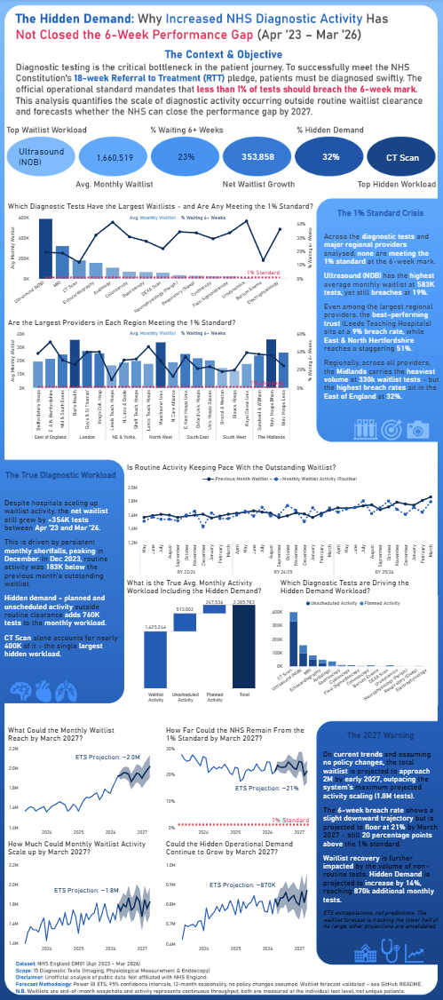
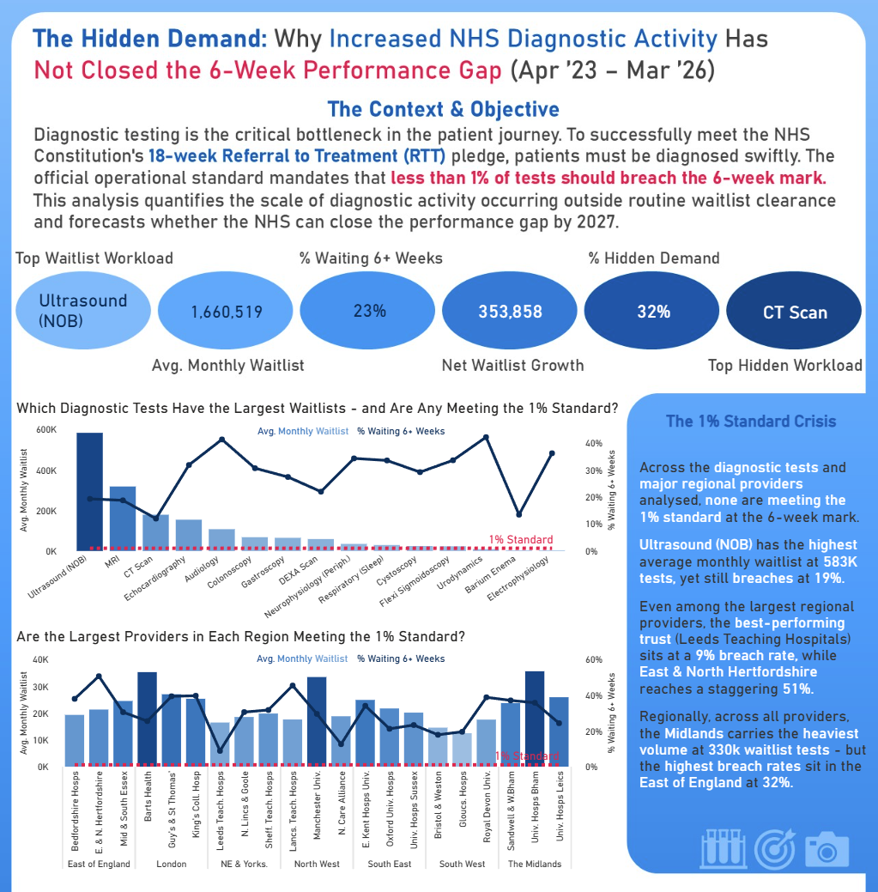
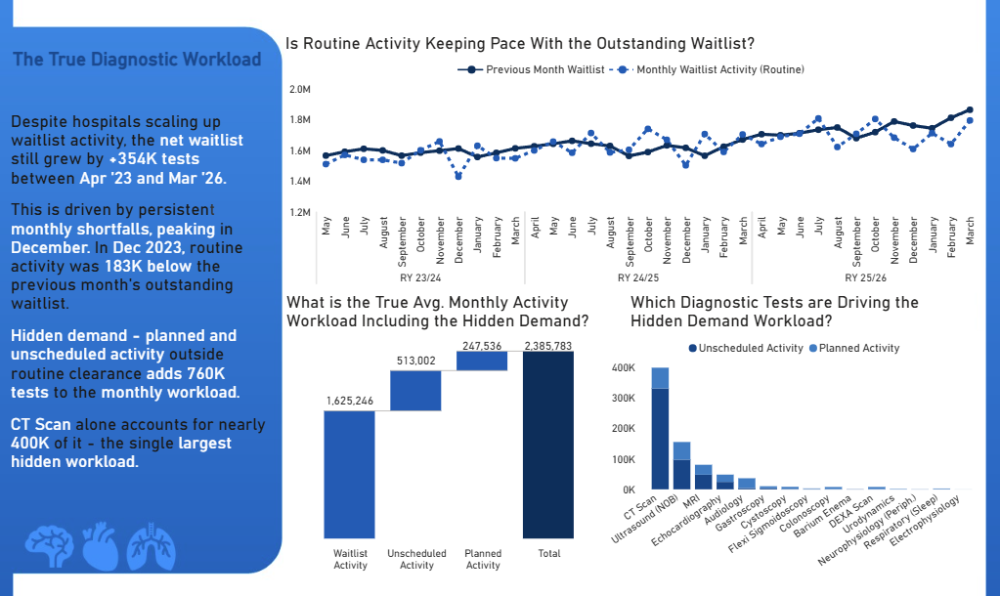
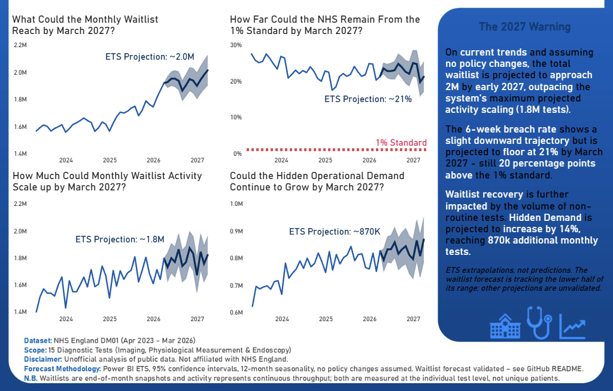
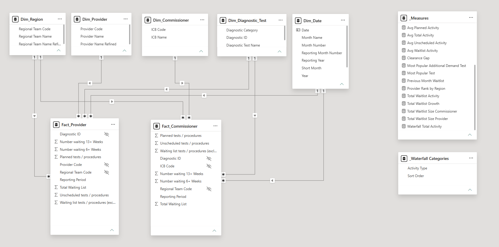

# NHS Diagnostic Waiting Times & Activity — Power BI Infographic

> **Why has increased NHS diagnostic activity not closed the 6-week performance gap?**

An analysis of NHS England DM01 diagnostic waiting times and activity, April 2023 – March 2026.

**Tools:** Power BI · Power Query · DAX · PowerPoint



---

## Key Findings

* **No diagnostic test category or major regional provider analysed met the 1% standard** at the 6-week mark in any month of the period.
* **Volume and performance are separate problems.** Ultrasound (NOB) carries the highest average monthly waitlist at roughly 583K tests while breaching at 19% — high volume does not predict the worst breach rate.
* **Provider performance varies enormously.** Among the largest providers in each region, breach rates ranged from 9% at Leeds Teaching Hospitals to 51% at East & North Hertfordshire.
* **Geography offers no protection.** Across all providers, the Midlands carries the heaviest regional volume at around 330K waitlist tests, while the East of England shows the highest regional breach rate at 32%.
* **Activity scaled up, but the backlog still grew.** The net waitlist grew by **+354K tests** between April 2023 and March 2026, driven by persistent monthly shortfalls that peak in December.
* **Non-waitlist activity absorbs a substantial share of capacity.** Roughly **760K** planned and unscheduled tests are performed every month on top of routine waitlist clearance — **32%** of all diagnostic activity. CT Scan alone accounts for nearly 400K of it.
* **The forecast offers little relief.** ETS projections suggest the waitlist could approach **2.0M** by early 2027 while activity scaling tops out around **1.8M**, with the breach rate flooring at roughly **21%** — still 20 percentage points above the standard.

> **Terminology note:** "Hidden demand" is an analytical term used in this project for planned and unscheduled diagnostic activity occurring outside routine waitlist clearance. The underlying activity streams are reported separately in the DM01 source data; NHS England does not group or label them this way.

**The overall picture:** diagnostic activity has increased and breach rates have improved, but the absolute waitlist continues to grow because a third of all diagnostic capacity is consumed by activity that never appears in waitlist clearance figures.

---

## Business Questions

The main business question was:

**Why has increased NHS diagnostic activity not closed the 6-week performance gap?**

Supporting questions:

* Which diagnostic tests carry the largest waitlists, and are any meeting the 1% standard?
* Are the largest providers in each region meeting the 1% standard?
* Is routine waitlist activity keeping pace with the outstanding waitlist?
* What is the true monthly activity workload once planned and unscheduled tests are included?
* Which diagnostic tests are driving that additional workload?
* Where could the waitlist, breach rate, activity, and hidden demand be by March 2027?

---

## Data and Scope

* **Source:** NHS England Monthly Diagnostic Waiting Times and Activity (DM01) published data.
* **Period:** April 2023 – March 2026 (36 months; three complete NHS reporting years).
* **Scope:** 15 mandated diagnostic tests across Imaging, Physiological Measurement, and Endoscopy.
* **Views collected:** Both the Provider view (organisations performing tests) and the Commissioner view (ICBs funding care for a population).

### Performance standards in context

Two thresholds are relevant to this period and are easily confused:

* **Constitutional operational standard:** less than **1%** of tests waiting 6+ weeks. This is the standard referenced throughout the infographic.
* **Interim recovery ambition:** NHS England separately set an ambition for **95%** of patients to receive a diagnostic test within six weeks (i.e. **≤5%** breaching) by March 2025.

At 23% breaching across the period, the system was materially above both the constitutional standard and the more achievable recovery ambition.

### Why the analysis starts in April 2023

DM01 data is published well before 2023, and a longer series would normally strengthen a time series analysis. The window was restricted deliberately.

COVID-19 introduces a major structural break that makes the pre-pandemic period substantially less comparable with the post-pandemic operating environment. Diagnostic activity collapsed in 2020, the 6-week standard was effectively suspended, and breach rates from those months do not measure the same operational reality as breach rates today. NHS England's own commentary flags pandemic disruption when interpreting historical DM01 trends.

That break could be modelled explicitly — as an intervention or regime change — but doing so would add complexity without serving the operational question this project asks. Instead, the analysis starts in **April 2023** to focus on a **more comparable post-pandemic operating period**, where every month is governed by broadly the same conditions. The system was still recovering during this window, so it is not a perfectly stable regime; it is simply a far more internally consistent one than any window spanning the pandemic.

The cost is a shorter history: three seasonal cycles rather than five or six. That trade was accepted deliberately, and its consequences for the forecast are set out in the validation section below.

The window also aligns exactly with the NHS reporting cycle, giving three complete April–March reporting years with no partial years distorting annual comparisons.

### Provider vs Commissioner

Both views were loaded, but the **Provider view was chosen as the analytical basis** because the question concerns the physical operational capacity and pressure of the organisations performing the tests.

Profiling both views confirmed the national totals matched exactly while regional buckets differed — evidence of **cross-border patient flow**. The East of England commissioner waitlist exceeded its provider waitlist, indicating patients registered in that region travelling elsewhere for tests; the South East showed the inverse. The Commissioner tables remain in the model for this comparison but do not drive the infographic visuals.

---

## The Analysis

### 1. The 1% Standard Crisis



Opens with context on why diagnostic testing matters to the 18-week RTT pledge, followed by six headline KPIs:

| KPI | Value |
| --- | --- |
| Top Waitlist Workload | Ultrasound (NOB) |
| Avg. Monthly Waitlist | 1,660,519 |
| % Waiting 6+ Weeks | 23% |
| Net Waitlist Growth | 353,858 |
| % Hidden Demand | 32% |
| Top Hidden Workload | CT Scan |

Two line-and-clustered-column charts plot average monthly waitlist as columns against the 6+ week breach rate as a line, with a constant line marking the 1% standard:

* **By diagnostic test** — which tests carry the largest waitlists, and whether any meet the standard.
* **By provider, grouped by region** — the three largest providers in each of the 7 regions, isolated using the `Provider Rank by Region` measure as a visual-level filter.

### 2. The True Diagnostic Workload



Explains why activity growth has not translated into waitlist recovery:

* **Clearance gap line chart** — current month routine waitlist activity plotted against the previous month's outstanding waitlist across all 36 months, exposing recurring monthly shortfalls. In December 2023, routine activity was 183K below the previous month's outstanding waitlist.
* **Activity waterfall** — decomposes true average monthly workload into waitlist activity (1,625,246), unscheduled activity (513,002), and planned activity (247,536), totalling **2,385,783** tests per month.
* **Stacked column by test** — which diagnostic tests absorb the most unscheduled and planned activity.

### 3. The 2027 Warning



Four forecast charts projecting 12 months to March 2027 using Power BI's native **Exponential Smoothing (ETS)** in the Analytics pane:

* Forecast length: **12 points** (one full reporting year)
* Seasonality: **12** (captures NHS winter seasonality)
* Ignore last: **0** (all three reporting years complete)
* Confidence interval: **95%**

Projected: monthly waitlist (~2.0M), % waiting 6+ weeks (~21%), monthly waitlist activity (~1.8M), and hidden demand (~870K).

---

## Forecast Validation

The model was trained on data ending March 2026. NHS England has since published April, May, and June 2026, allowing the **total waitlist forecast** to be tested against data it never saw.

It is benchmarked against a **naive persistence forecast** — the assumption that every future month equals the last observed value (March 2026, 1.92M). Beating naive is the standard bar in forecasting: a model that cannot outperform "assume nothing changes" is not earning its complexity.

| Month | Actual | ETS forecast | 95% interval | ETS error | Naive forecast | Naive error |
| --- | --- | --- | --- | --- | --- | --- |
| Apr 2026 | 1.94M | 1.92M | 1.88M – 1.96M | −1.0% | 1.92M | −1.0% |
| May 2026 | 1.90M | 1.95M | 1.90M – 2.00M | +2.6% | 1.92M | +1.1% |
| Jun 2026 | 1.92M | 1.95M | 1.90M – 2.00M | +1.6% | 1.92M | 0.0% |
| **MAE** | | | | **~1.7%** | | **~0.7%** |

*Published figures are rounded, so error percentages are approximate. July 2026 data had not been released at the time of writing.*

**What the validation shows:**

* **Interval coverage is sound.** All three actuals fall inside the 95% bands, so the model's uncertainty estimate is honest rather than overconfident.
* **The naive baseline wins on point accuracy.** ETS ties in April and loses in May and June, with roughly 2.5× the mean absolute error of persistence. At a one-to-three-month horizon, this model does not beat doing nothing.
* **Point estimates lean high.** ETS over-predicted in two of three months and every actual sits in the lower half of its interval. The model learned an upward trend from the training window while the observed series has flattened, oscillating around 1.92M.
* **Error compounds with horizon.** A three-month check does not validate a twelve-month projection. The widening confidence band is the model's own statement that March 2027 is a substantially weaker claim than June 2026.

**Scope of validation.** Only the total waitlist forecast has been validated. The breach rate, activity scaling, and hidden demand projections shown in Section 3 are unvalidated extrapolations.

**Implication for the 2027 projection.** Three months is not enough to declare a trend change — the flattening could be a genuine plateau, a seasonal effect, or noise. It is enough to say the waitlist is currently tracking the **lower half of the forecast range**. The 2.0M figure should be read as the upper end of a plausible range, not as a prediction.

Retaining a forecast that loses to its own baseline is deliberate. The exercise demonstrates seasonality handling, uncertainty quantification, out-of-sample testing, and model criticism — and the finding that a flattening series is hard to forecast is itself a result.

---

## Data Model

A **star schema** with two fact tables sharing conformed dimensions:

| Table | Type | Purpose |
| --- | --- | --- |
| `Fact_Provider` | Fact | Provider-level waitlist and activity — analytical basis of the infographic |
| `Fact_Commissioner` | Fact | Commissioner (ICB) level waitlist and activity, retained for the cross-border comparison |
| `Dim_Date` | Dimension | Continuous daily calendar, marked as the official date table |
| `Dim_Diagnostic_Test` | Dimension | 15 tests flattened with their 3 parent categories |
| `Dim_Provider` | Dimension | Provider ODS codes and names |
| `Dim_Commissioner` | Dimension | ICB codes and names |
| `Dim_Region` | Dimension | Regional teams, conformed across both fact tables |
| `_Measures` | Measures table | Central home for all DAX measures |
| `_Waterfall Categories` | Disconnected table | Drives the activity waterfall chart |



Design decisions:

* **Star over snowflake.** The 15 tests and 3 categories were flattened into one dimension rather than split. At 15 rows the storage saving from normalisation is negligible, while the single filter hop is a real performance and usability gain.
* **Dedicated `Dim_Date`** despite monthly-grain data, because DAX time intelligence requires a contiguous daily calendar.
* **Conformed `Dim_Region`** built by referencing both fact tables, appending, and deduplicating, so the region dimension serves both views.
* **Dedicated measures table** so measures are not scattered across fact tables.

---

## Power Query

Key transformations applied to the fact tables:

* **Removed pre-aggregated total rows.** Diagnostic ID 16 is a pre-calculated total per provider/ICB. These were filtered out to prevent double counting. This could not be done positionally, since providers offering a limited test range do not produce a total on a predictable row.
* **Built a proper date column** by merging the separate `Month` and `Year` columns and converting to Date type.
* **Anchored dates to end of month**, because the waiting list is an end-of-month snapshot and activity accrues across the month.
* **Enabled full-dataset column profiling** so quality checks reflected all rows rather than the default 1,000-row preview.
* **Built dimensions by reference and deduplication** rather than duplicating queries, so the engine reuses cleaned fact output instead of reprocessing source files.
* **Created refined display columns** for test, provider, and region names to keep axis labels legible on a static canvas, leaving raw names intact for auditability.

<details>
<summary><strong>Data quality investigation — full detail</strong></summary>

**Provider code duplication.** Profiling returned 479 distinct provider codes against 462 unique values — around 17 codes appeared multiple times because the provider name had been submitted inconsistently across the three years, a slowly changing dimension.

Deduplicating on both columns failed, since Power Query evaluates the full row as a single string and inconsistent names therefore read as distinct rows. The fix was **targeted deduplication on `Provider Code` only**, preceded by `Trim` and `Capitalize Each Word` on the name column to normalise casing and whitespace.

**Multiple codes for the same hospital.** Duchy Hospital and Circle Reading Hospital each appeared under two different ODS codes. These were deliberately **left unmodified**. Overwriting them would alter the historical record of how the organisation submitted its data. The star schema still resolves correctly because relationships are built on the code, and Power BI groups the identical display names when aggregating.

**Region mismatch between views.** Providers have 7 regions; commissioners have 8, the extra being `X24 NHS England` — the central body directly commissioning specialised services, armed forces, and health and justice care. NHS England commissions but does not perform tests, so it never appears in provider data. `Dim_Region` was built by appending both region lists and deduplicating, so neither relationship breaks.

**Label refinement.** Because the infographic is static, truncated or slanted axis labels cannot be resolved by user interaction. Refined columns were created via Conditional Column and Replace Values:

* `Diagnostic Test Name Refined` — Magnetic Resonance Imaging → **MRI**, Computed Tomography → **CT Scan**, Non-obstetric ultrasound → **Ultrasound (NOB)**, Neurophysiology - Peripheral neurophysiology → **Neurophysiology (Periph.)**
* `Provider Name Refined` and `Regional Team Name Refined` — East and North Hertfordshire → **E. & N. Hertfordshire**, Northern Lincolnshire and Goole → **N. Lincs & Goole**, North East and Yorkshire → **NE & Yorks.**

</details>

---

## DAX

The model contains 23 measures in a dedicated `_Measures` table. The most significant are shown below; the full set is expandable.

**Volume, handled as a semi-additive measure:**

```dax
Avg Monthly Waitlist Provider = 
AVERAGEX (
    VALUES('Dim_Date'[Date]), 
    [Total Waitlist Size Provider]
)

Total Waitlist Size Provider = SUM(Fact_Provider[Total Waiting List])
```

**Performance, recalculated from numerator and denominator rather than averaging a stored percentage:**

```dax
% Waiting at 6+ weeks = 
DIVIDE(
    SUM(Fact_Provider[Number waiting 6+ Weeks]),
    [Total Waitlist Size Provider],
    "-"
)
```

**Clearance gap, comparing current activity against the previous month's outstanding waitlist:**

```dax
Previous Month Waitlist = 
CALCULATE(
    [Total Waitlist Size Provider],
    DATEADD(Dim_Date[Date], -1, MONTH)
)

Clearance Gap = [Waitlist Activity] - [Previous Month Waitlist]
```

**Ranking within region, which Power BI's native Top N filter cannot do:**

```dax
Provider Rank by Region = 
RANKX(
    ALLSELECTED(Dim_Provider[Provider Name Refined]),
    [Avg Monthly Waitlist Provider],
    ,
    DESC,
    Dense
)
```

<details>
<summary><strong>Full DAX measures</strong></summary>

**Date table**

```dax
Dim_Date =
ADDCOLUMNS (
    CALENDAR ( DATE(2023, 1, 1), DATE(2026, 12, 31) ),
    "Year", YEAR([Date]),
    "Month Number", MONTH([Date]),
    "Month Name", FORMAT([Date], "MMMM"),
    "Short Month", FORMAT([Date], "MMM"),
    "Year Month", FORMAT([Date], "MMM YYYY"),
    "Year Month Sort", YEAR([Date]) * 100 + MONTH([Date]),
    "Reporting Month Number", IF ( MONTH([Date]) >= 4, MONTH([Date]) - 3, MONTH([Date]) + 9 ),
    "Reporting Year",
        IF (
            MONTH([Date]) >= 4,
            YEAR([Date]) & "/" & RIGHT( YEAR([Date]) + 1, 2 ),
            YEAR([Date]) - 1 & "/" & RIGHT( YEAR([Date]), 2 )
        )
)
```

Full calendar years were generated rather than only the data span, so time intelligence does not break at the boundaries. The reporting year runs April–March to match the NHS operational cycle — deliberately not called a financial year, since this is operational rather than budget data. `Year Month Sort` forces chronological rather than alphabetical sorting.

**Volume and performance**

```dax
% Waiting at 13+ weeks =
DIVIDE(SUM(Fact_Provider[Number waiting 13+ Weeks]),
      [Total Waitlist Size Provider],
      "-"
)
```

```dax
% Diagnostic Test Waitlist Contribution = Divide([Avg Monthly Waitlist Provider],
                                                CALCULATE([Avg Monthly Waitlist Provider], All(Dim_Diagnostic_Test[Diagnostic Test Name Refined])),
                                                "-"
)
```

```dax
Total Waitlist Growth =
VAR StartWaitlist =
    CALCULATE ( SUM ( Fact_Provider[Total Waiting List] ), 'Dim_Date'[Date] = DATE(2023, 4, 30) )
VAR EndWaitlist =
    CALCULATE ( SUM ( Fact_Provider[Total Waiting List] ), 'Dim_Date'[Date] = DATE(2026, 3, 31) )
RETURN
    EndWaitlist - StartWaitlist
```

```dax
1% Target = 0.01
```

```dax
Average Monthly Waitlist Commissioner =
AVERAGEX (
    VALUES('Dim_Date'[Date]), 
    [Total Waitlist Size Commissioner]
)

Total Waitlist Size Commissioner = SUM(Fact_Commissioner[Total Waiting List])
```

Used only for the provider-vs-commissioner cross-border comparison, not in the infographic visuals.

**Clearance gap**

```dax
Avg Monthly Clearance Gap =
AVERAGEX (
    FILTER (
        VALUES ( 'Dim_Date'[Year Month Sort] ),
        NOT ISBLANK ( [Waitlist Activity] ) && NOT ISBLANK ( [Previous Month Waitlist] )
    ),
    [Clearance Gap]
)
```

The `FILTER` wrapper trims boundary months where one side of the equation does not exist, so the average covers only mathematically valid months.

**Activity and hidden demand**

```dax
Avg Waitlist Activity
AVERAGEX (
    VALUES('Dim_Date'[Date]), 
    [Total Waitlist Activity]
)

Avg Unscheduled Activity =
AVERAGEX (
    VALUES('Dim_Date'[Date]),
    CALCULATE(SUM(Fact_Provider[Unscheduled tests / procedures]))
)

Avg Planned Activity =
AVERAGEX (
    VALUES ( 'Dim_Date'[Date] ),
    CALCULATE ( SUM ( Fact_Provider[Planned tests / procedures] ) )
)
```

```dax
Avg Hidden Demand = [Avg Unscheduled Activity] + [Avg Planned Activity]

Avg Total Activity = [Avg Waitlist Activity] + [Avg Unscheduled Activity] + [Avg Planned Activity]

% Hidden Demand = 
DIVIDE (
    [Avg Hidden Demand],
    [Avg Total Activity],
    "-"
)
```

```dax
Waterfall Total Activity =
SWITCH (
    SELECTEDVALUE('_Waterfall Categories'[Activity Type]),
    "Waitlist Activity", [Avg Waitlist Activity],
    "Unscheduled Activity", [Avg Unscheduled Activity],
    "Planned Activity", [Avg Planned Activity],
    BLANK()
)
```

Power BI's waterfall visual accepts only a single field on the Y-axis, so three separate measures could not be stacked directly. A **disconnected table** provides the category axis and a `SWITCH` measure resolves which activity stream to return.

**KPI card generation**

```dax
Most Popular Test =
CALCULATE (
    MAX ( 'Dim_Diagnostic_Test'[Diagnostic Test Name] ),
    TOPN ( 1, ALL ( 'Dim_Diagnostic_Test'[Diagnostic Test Name] ), [Average Monthly Waitlist], DESC )
)

Most Popular Additional Demand Test =
CALCULATE (
    MAX ( 'Dim_Diagnostic_Test'[Diagnostic Test Name] ),
    TOPN ( 1, ALL ( 'Dim_Diagnostic_Test'[Diagnostic Test Name] ), [Avg Additional Demand], DESC )
)
```

</details>

---

## Analytical Decisions and Assumptions

* **Averages, not three-year totals.** The waitlist is a **semi-additive** measure — summing 36 monthly snapshots produces a meaningless ~59.7M figure that counts the same unresolved waits repeatedly across consecutive months. All volume metrics were rebuilt as monthly averages so every figure on the infographic describes the same thing: the monthly operational load.
* **Never average a percentage.** The source contains a pre-calculated `% 6 week+` column. Aggregating it with `Average` gives the average of ratios rather than the ratio of totals, which is wrong when providers differ in size. The percentage is recalculated from raw numerator and denominator.
* **The clearance gap is not a supply-and-demand measure.** It compares current-month routine activity against the previous month's outstanding waitlist — a stock of existing work, not incoming referrals. A negative gap indicates throughput insufficient to clear the existing stock, before accounting for new additions to the list.
* **The cold-start boundary.** March 2023 is outside the dataset, so `Previous Month Waitlist` is blank for April 2023. The clearance gap series therefore begins in May 2023, and its average is filtered to valid months only.
* **Test level, not patient level.** All volumes count individual diagnostic tests. A patient may be waiting for or receiving several tests simultaneously, so figures are not unique patient counts.
* **Snapshot vs throughput.** Waitlist volumes are end-of-month snapshots; activity is continuous monthly throughput. This is why current-month activity is compared against the previous month's waitlist.
* **Provider basis and scope.** Provider-level statements reflect the top three providers per region by waitlist size. Regional aggregates are calculated across all providers in the region.
* **Forecasts extrapolate historical behaviour only.** They assume no policy change, no capacity intervention, and no further structural break, and are fitted on three seasonal cycles — the minimum viable basis for a seasonal model.

---

## Design and Build

* Canvas designed in **PowerPoint** and exported as a background image, keeping the Power BI file lightweight and avoiding dozens of shape visuals.
* **NHS Blue (#005EB8)** and its tints as the base palette, with red reserved exclusively for the 1% standard reference lines.
* A **three-tier vertical narrative**: headline KPIs and the performance failure → the workload explanation → forecast and caveats.
* Charts and KPI cards built natively in Power BI and positioned into designated zones on the imported background.
* Each chart titled as a **question**, so the reader knows what to look for before reading the visual.
* Executive summary panels alongside each section carry the narrative for readers who do not study the charts in detail.

---

## Limitations

* **Association, not causation.** The analysis shows that non-waitlist activity consumes a large share of capacity alongside persistent waitlist growth. It does not isolate that activity as the sole cause.
* **Not a measure of efficiency.** Activity volumes and breach rates are reported; no output-per-resource metric was calculated, so no efficiency claim is made.
* **Provider scope.** Charted provider performance covers the three largest providers per region, not the full provider population.
* **Forecast validation is partial.** Only the total waitlist projection has been tested out-of-sample, and it does not currently beat a naive baseline.
* **Manual ingestion.** Source files were consolidated before loading rather than combined through a Power Query folder connection, so refresh is not fully automated.
* **Test-level counts.** Figures do not represent unique patients or complete diagnostic pathways.

---

## Files

| File | Description |
| --- | --- |
| `nhs-diagnostic-waiting-times-and-activity-infographic.pbix` | Power BI file: data model, Power Query transformations, DAX measures, and final infographic. |
| `pbi1-infographic-preview.png` | Full infographic. |
| `pbi1-infographic-top.png` | Section 1 — headline KPIs and the 1% standard. |
| `pbi1-infographic-middle.png` | Section 2 — the true diagnostic workload. |
| `pbi1-infographic-bottom.png` | Section 3 — the 2027 forecast. |

---

## Disclaimer

Unofficial analysis of publicly available NHS England DM01 data. Not affiliated with or endorsed by NHS England. All volumes represent individual diagnostic tests, not unique patient pathways. Forecasts assume no external policy changes.

---

## Project Status

Completed project 3 of 5
